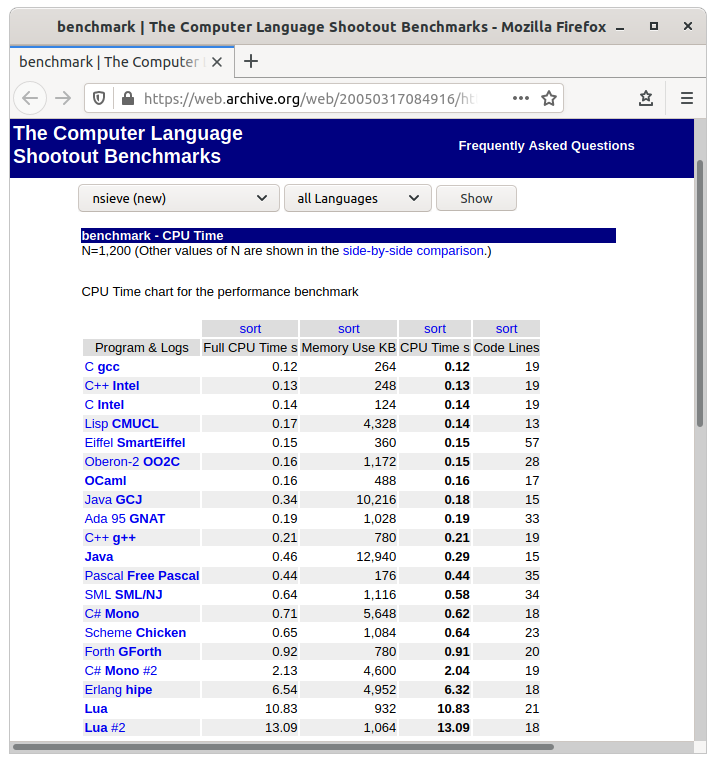
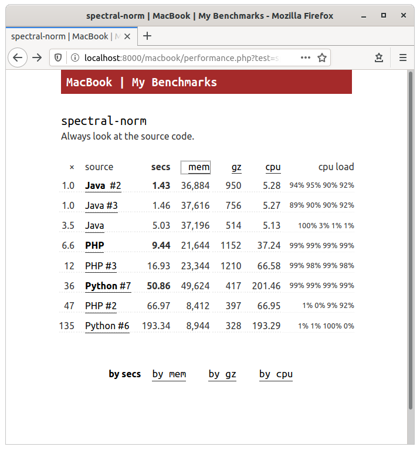
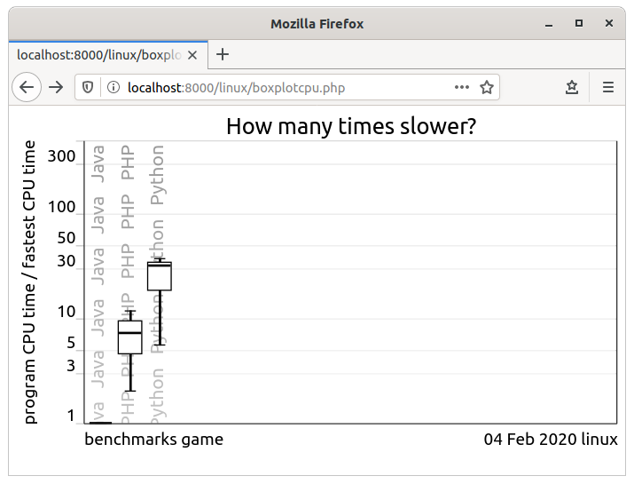
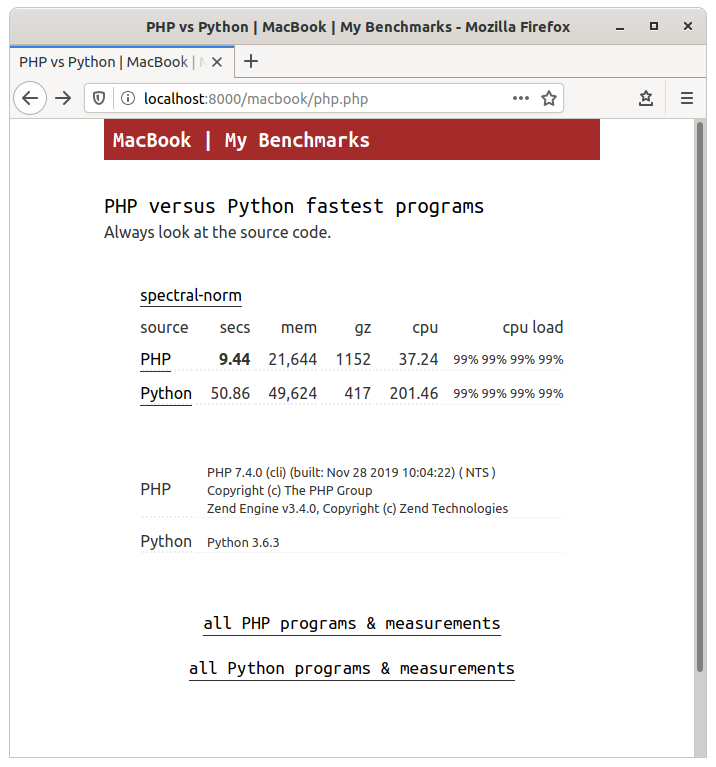
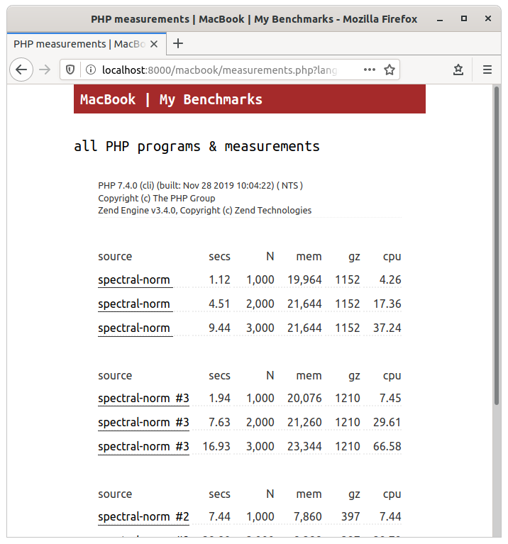
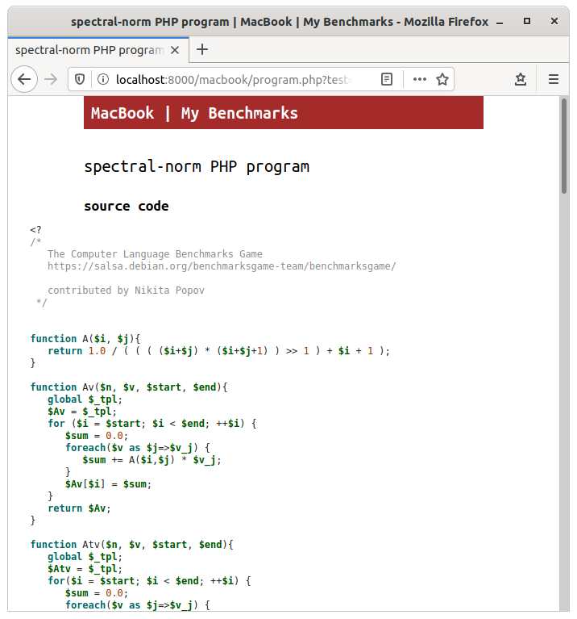

The Benchmarks Game — mybenchmarks
==================================

Overview
--------
* mybenchmarks is an example of how to use the current benchmarks game PHP website scripts to show program measurements made with the [Python bencher scripts](../bencher).

* Different sets of measurements are separated into different folders, for example: [mybenchmarks/websites/linux](websites/linux) and [websites/macbook](websites/macbook).

* [websites/index.html](websites/index.html) can link to those different measurements
   
Background
----------
* Over 15 years these scripts have been changed in many small and large ways, and the configuration files and script files provide functionality that is no longer required. Be aware, there are cobwebs.

* Some of the changes: multiple data sets / one data set,  drop-down menus / simple hrefs, dynamic pages / static pages / both, JavaScript / no JavaScript, external style sheet / inline CSS, *etc*.

* These scripts (originally written for PHP 4) are now run with PHP 7.4 (but have not been converted to PHP 7).

* Most of the configurability never was used (for example [mybenchmarks/websites/linux/config.php](websites/linux/config.php)) 

Example
-------
```
 $ cd ~/mybenchmarks/websites
 $ ??? php-7.4.0/bin/php -S localhost:8000

 http://localhost:8000/linux/java.php

 $ cat linux/java.php
 <?php
 ob_start('ob_gzhandler');
 require_once('config.php');
 $T = 'all'; $L = 'java'; $metaRobots = '';
 require_once(LIB_PATH.'compare.php');
 ?>
```

* Define paths and some variables for the linux webpages. Specify test `$T` and language implementation `$L`. Filter the data and set template variables for [~/mybenchmarks/lib/compare.php](lib/compare.php) and [compare.tpl.php](lib/compare.tpl.php).

* [compare.php](lib/compare.php) mostly **data**; [compare.tpl.php](lib/compare.tpl.php) mostly **presentation**. (See Brian E. Lozier's [~/mybenchmarks/lib/lib.php](lib/lib.php))


Gotchas
-------
* Data will be ignored if the test and language implementation are not listed in: [linux/include.csv](websites/linux/include.csv) and / or [macbook/include.csv](websites/macbook/include.csv) and [~/mybenchmarks/desc/test.csv](desc/test.csv) and [~/mybenchmarks/desc/lang.csv](desc/lang.csv)
       
* Data will be ignored if the test and / or language implementation are listed in: [~/mybenchmarks/desc/exclude.csv](desc/exclude.csv)

* Various kinds-of presentation label are defined in [desc/test.csv](desc/test.csv) and [desc/lang.csv](desc/lang.csv)

* The 6th and 7th fields in [desc/lang.csv](desc/lang.csv) define a default comparison (there should always be a default comparison) and a default  language implementation (empty if not the default implementation)

* inline CSS, sorry. To change the CSS background color used in headings, find `#macbook` and / or `#linux` in the page $style and edit the background color. In [lib/compare.php](lib/compare.php), [lib/measurements.php](lib/measurements.php), [lib/performance.php](lib/performance.php) and [lib/program.php](lib/program.php).

Usage
-----
1. Try a localhost website using the example data. 

1. Once you have that working, replace the example data with your data. Delete the contents of [websites/linux/code](websites/linux/code), [linux/data](websites/linux/data), and [version](websites/linux/version); and replace with your data and version files. Delete the contents of [macbook/code](websites/macbook/code), [data](websites/macbook/data), and [version](websites/macbook/version); and replace with your data and version files.

1. Change `SITE_NAME` and `PLATFORM_NAME` in [linux/config.php](websites/linux/config.php) and [macbook/config.php](websites/macbook/config.php) to names appropriate for your measurement sets.

1. Change the [mybenchmarks/websites/linux](websites/linux) and [macbook](websites/macbook) folder names to match the new `SITE_NAME`.

1. Change the inline CSS to match the new `SITE_NAME`.

15 years ago
------------


2020
----







